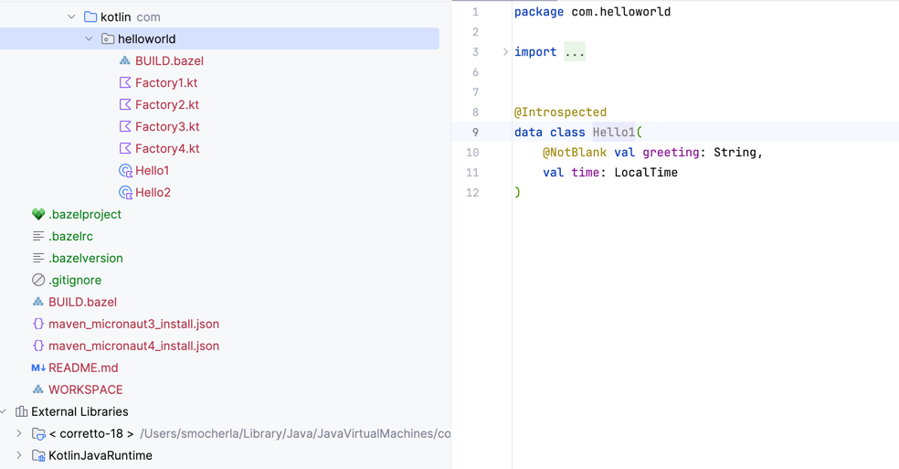
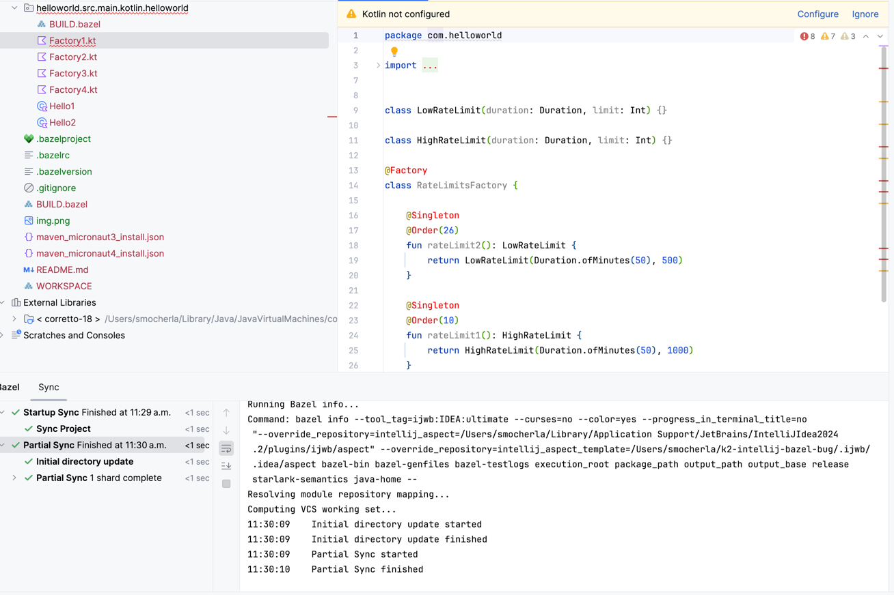

# IntelliJ K2 Mode Issue with Bazel plugin

This is a small project to illustrate how K2 mode doesn't work with Bazel Plugin with IntelliJ 2024.3.

Repro steps:
1. Install IntelliJ 2024.3 and then the Bazel plugin (tested with 2024.11.19.0.1-api-version-243)
2. Import this repo as a Bazel project
3. Try doing a partial sync on the `helloworld` package without K2 mode enabled (default) and verify syntax highlighting works as usual as seen below.

4. Also observe that `KotlinJavaRuntime` required for the kotlin plugin is available.
5. Now switch to K2 mode and restart IntelliJ
6. Retry partial sync on `helloworld` package.
7. Partial sync completes but `Kotlin not configured` panel shows up and the `KotlinJavaRuntime` is removed from the kotlin facet

Uses Bazel 6.4, Kotlin 2.0, with rules_kotlin 2.0. Also doesn't work with rules_kotlin 1.9 and Kotlin 1.9 (K2 mode would appear to support 1.9 as well).
